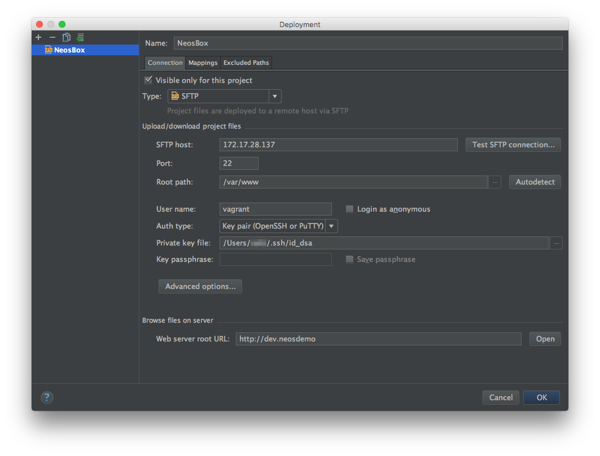
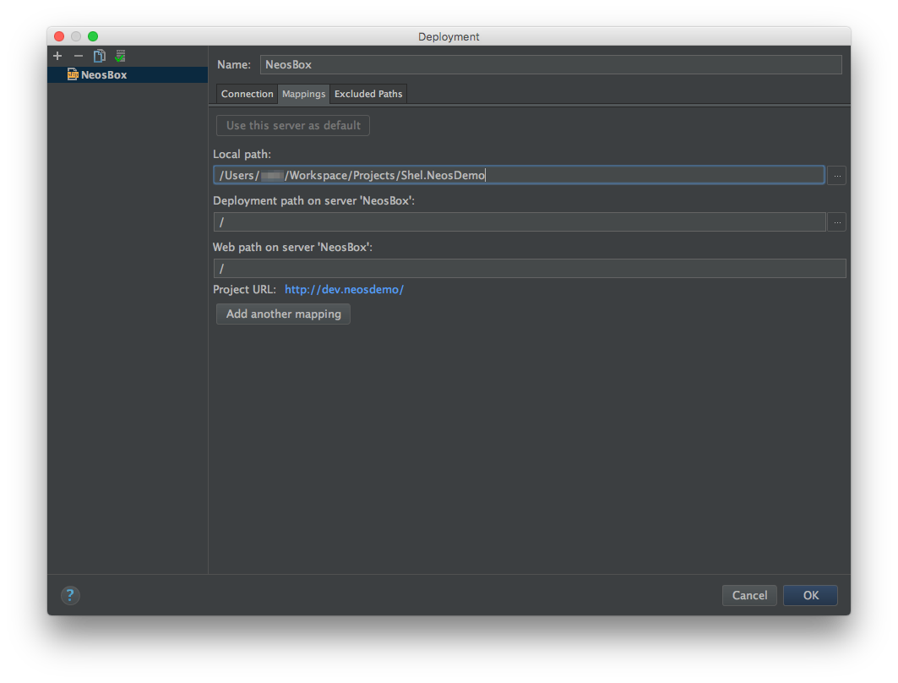
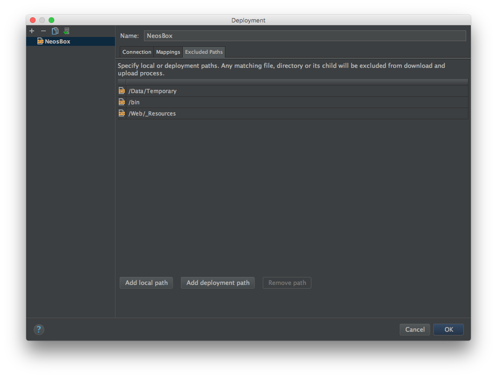

# Neosdemo for testing Neos and running surf deployments

## Starting

Run
   
    vagrant up
    
Edit your `/etc/hosts` file and add:

    # Neosdemo
    172.17.28.137 dev.neosdemo
    172.17.28.138 staging.neosdemo    
    
## Setup each box

### Dev

    vagrant ssh dev
    
#### Installation

Append your public key to the vagrant user in `/home/vagrant/.ssh/authorized_keys`.

Now you can login via:
   
    ssh -A vagrant@dev.neosdemo
    
Add the following to `/etc/hosts`:

    172.17.28.138 staging.neosdemo
    
#### Developing

Open this folder in PHPStorm and setup automatic deployment to the dev box like in the screenshots:

Now right click on the project and run `Deployment -> Upload to neosbox` for the first time.
In `Tools` -> `Deployment` enable `Automatic Upload` and in the options `Upload external changes`.

Now your ready to go and can open your neos site for the first time by opening http://dev.neosdemo/ in your browser.

* Go through the wizard. The install tool pw will be created and you have to check it in `/var/www/Data/SetupPassword.txt`. 
* If the wizard asks you for the db credentials enter `root` as username and password and select the database `neos`.
* Enter your information when asked to create a new admin user.
* Import the neosdemo example content
* Login into the backend
* Done!
    
### Staging 
    
    vagrant ssh staging
    
#### Installation

Append your public key to the vagrant user in `/home/vagrant/.ssh/authorized_keys`.

Now you can login via:
   
    ssh -A vagrant@dev.neosdemo
    
Modify the vhost in `/usr/local/etc/nginx/common-neos.conf`:
    
* Change `root /var/www/Web/` to `root /var/www/releases/current/Web`.
* Add after `fastcgi_param  FLOW_REWRITEURLS  1;` the line `fastcgi_param FLOW_CONTEXT Production;`.
* Restart nginx via `sudo service nginx restart`.
* Change vagrant users shell to bash via `sudo chsh -s /usr/local/bin/bash vagrant`.

Install composer with the following commands:

    php -r "copy('https://getcomposer.org/installer', 'composer-setup.php');"
    php -r "if (hash_file('SHA384', 'composer-setup.php') === 'e115a8dc7871f15d853148a7fbac7da27d6c0030b848d9b3dc09e2a0388afed865e6a3d6b3c0fad45c48e2b5fc1196ae') { echo 'Installer verified'; } else { echo 'Installer corrupt'; unlink('composer-setup.php'); } echo PHP_EOL;"
    php composer-setup.php
    php -r "unlink('composer-setup.php');"
    
## Deploying

Run

    ./surf.phar deploy staging

After it finished go to http://staging.neosdemo and run the wizard like before.

Done!

## Setup gitlab

### Login or create an account

For simple testing we use a free gitlab.com account.
If you don't have an account yet, create one and add your public key to your profile.

### Setup project

Create a new repository and push this repository to it with git.

Change the `repositoryUrl` in `.surf/staging.php` to the url of your new repository.

### Setup gitlab runner in staging box

Install wget in the staging box via `sudo pkg install wget`.

Install gitlab ci runner in staging box as described on https://gitlab.com/gitlab-org/gitlab-ci-multi-runner/blob/master/docs/install/freebsd.md.

For the runner configuration use 

* coordinator url: https://gitlab.com/ci
* token: use the one from your project configuration in `Runners`
* give it the name `staging-neosdemo`
* you don't need any tags
* use `shell` as executor
* done!

By now you should have some changes in your code, commit and push those to the gitlab repo.

Create keys for the gitlab-runner user:
 
    sudo su - gitlab-runner
    ssh-keygen -t rsa -b 4096 -C "mydemorunner"
    
Copy the public key in `/home/gitlab-runner/.ssh/id_rsa.pub` to the vagrant users authorized keys in `/home/vagrant/.ssh/authorized_keys`.

Create keys for the vagrant user as user vagrant:
 
    ssh-keygen -t rsa -b 4096 -C "mydemovagrant"
    
Copy the public key in `/home/vagrant/.ssh/id_rsa.pub` and add it as deploy key in your gitlab repo.

Congrats, you now have a deployment pipeline!
